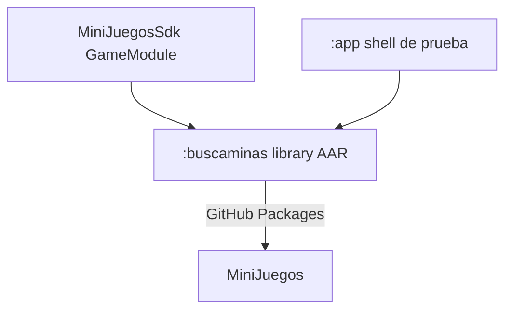
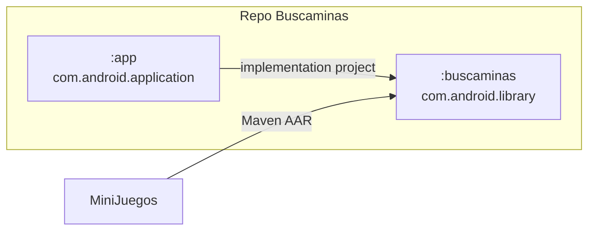
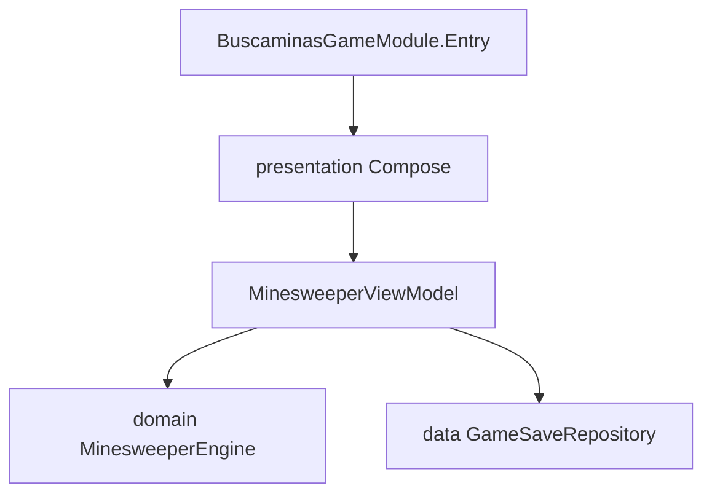
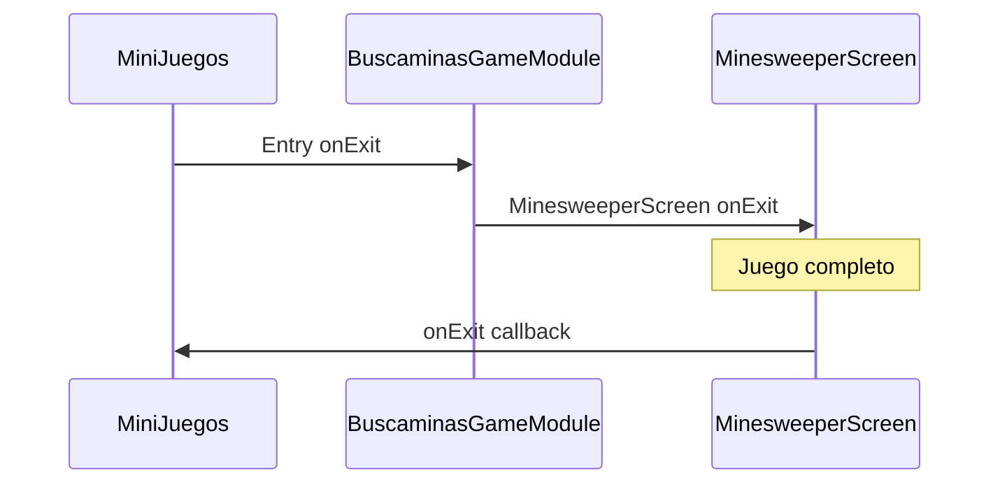
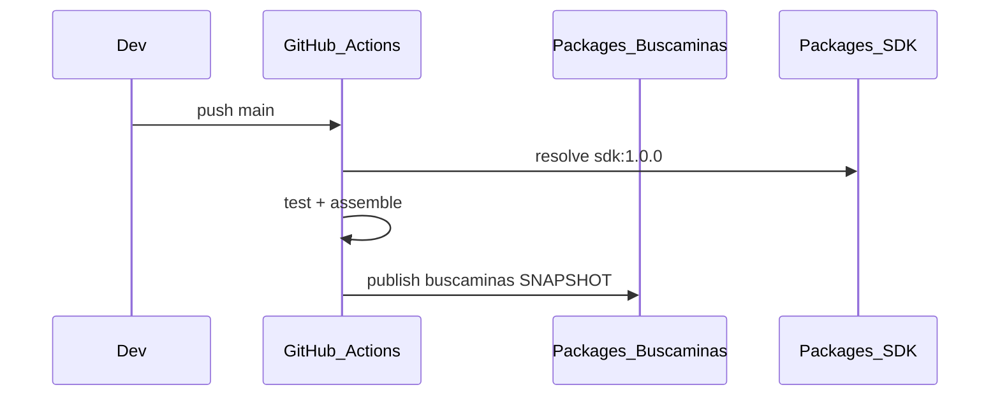

# Estructura — Buscaminas

## Rol en el ecosistema



## Árbol del proyecto

```
Buscaminas/
├── .github/workflows/ci.yml
├── app/                         # APK de prueba
│   └── src/main/java/.../app/MainActivity.kt
├── buscaminas/                  # Library → AAR
│   ├── build.gradle.kts         # maven-publish + dependencias
│   └── src/main/java/pelkidev/com/mx/buscaminas/
│       ├── BuscaminasGameModule.kt
│       ├── domain/
│       ├── data/
│       ├── presentation/
│       └── ui/theme/
├── settings.gradle.kts
└── docs/
```

## Dualidad library + shell



| | `:buscaminas` | `:app` |
|--|---------------|--------|
| Salida | AAR | APK |
| `applicationId` | no | `pelkidev.com.mx.buscaminas` |
| Entry | `BuscaminasGameModule` | `MainActivity` → `Entry` |
| Recursos | prefijo `buscaminas_` | launcher, tema de app |

**Por qué no publicar el módulo `app`:** un `application` produce APK, no un artefacto embebible idiomático. El host necesita un library.

## Capas del library



- **domain**: reglas puras del tablero (testeable sin Android).
- **data**: guardar / restaurar partida.
- **presentation**: UI y estado observable.
- **Entry**: único punto que conoce el host; aplica `BuscaminasTheme` y pasa `onExit`.

## Entrypoint hacia el host



## Publicación



Coordenadas:

- Publish URL: `https://maven.pkg.github.com/AlejandroHP17/Buscaminas`
- Artifact: `pelkidev.com.mx.minijuegos:buscaminas:1.0.0-SNAPSHOT`

## Alineación técnica

- `minSdk 29`, Compose BOM alineado con host/SDK
- `resourcePrefix = "buscaminas_"` evita colisiones de `R`
- `api(sdk)` para que el host vea `GameModule` transitivamente (el host también declara el SDK de forma explícita)
